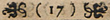
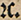

# Historical dance bibliography: Transcriptions

Транскрипция — это набранный текст источника (книги или манускрипта). Транскрипции упрощают работу с источником и предоставляют некоторые дополнительные возможности (например, поиск по тексту). Примеры набранных транскрипций лежат [тут](https://github.com/hda-technical/dancebooks/tree/master/transcriptions), в обработанном виде их можно найти [здесь](https://bib.hda.org.ru/advanced-search?transcription=true).

## Как сделать транскрипцию?

1. **Что я могу транскрибировать?** Напишите Юрию Чернышову, он подскажет, с какого источника начать, проследит за тем, чтобы два человека не делали одну и ту же работу.
2. **У меня есть источник. Что набирать?** Транскрибируется весь текст источника за исключением титульных страниц, содержания, нотного материала, иллюстраций и подписей к ним. Если в книге присутствует [эррата](https://en.wikipedia.org/wiki/Erratum), она оформляется отдельным пунктом. Ошибки, упомянутые в эррате, **не вносятся в транскрипцию источника**.
3. **Как набирать?** Все транскрипции оформляются в оригинальной орфографии максимально близко к тексту.

	Никакие опечатки не исправляются, никакие сокращения (включая [сокращения под тильдой](https://en.wikipedia.org/wiki/Tilde#Abbreviation)) **не раскрываются**.

	Текст набирается с тем же разбиением на строки, что и в оригинале **в том числе в заголовках**
	(см. пример в [соответствующем разделе](#header)),
	а символы переноса размечаются специальным образом
	(подробности — в разделе [про переносы строк](#line-break)).

	Обращайте внимание на знаки препинания:
	не путайте тире и дефисы,
	ставьте те кавычки, которые использует автор,
	следите за расстановкой точек в скобках и после чисел.

	В текстах могут встречаться непонятные символы; правила их набора описаны в [соответствующей части](#unicode).

5. **Где набирать?** Мы используем формат [markdown](http://daringfireball.net/projects/markdown/syntax), чтобы все транскрипции выглядели одинаково и с ними было удобно работать. Он отличается от обычного текстового файла специальной разметкой (см. ниже). Текст можно набирать в блокноте (удобнее — в [Notepad++](https://notepad-plus-plus.org/), вам нужна кодировка UTF-8) или в Google Docs. Предварительно посмотреть набранный текст можно в расширении браузере Firefox при помощи расширения [Markdown Viewer](https://addons.mozilla.org/en-GB/firefox/addon/markdown-viewer-webext/). Посмотреть файл в окончательном виде вы сможете только после того, как загрузите его в библиографию.
6. **Что за разметка?** Вот основные символы разметки, которые могут вам пригодиться:

	| Разметка | Производимый ею эффект |
	| -------- | ---------------------- |
	| Абзац | **Абзацы в markdown отделяются друг от друга дополнительной пустой строкой.** |
	| `[-]` | Означает **напечатанный** символ переноса. Подробности [здесь](#line-break). |
	| `[-?]` | Означает **пропущенный** символ переноса. Подробности [здесь](#line-break). |
	| `fa[ce?]` | Текст в квадратных скобках обозначает угаданную в процессе транскрипции часть слова. |
	| `**Текст, окружённый двойными звёздочками**` | Делает текст **жирным**. |
	| `_Текст, окружённый подчёркиваниями_` | Выделяет текст _курсивом_. |
	| `### Заголовок` | Делает текст заголовком. |
	| `{123}` | Проставляет номер страницы (в данном случае — 123). Подробности [здесь](#page). |
	| `[[Текст сноски]]` | Превращает текст внутри двойных квадратных скобок в сноску. Подробнее см. [здесь](#footnote). |
	| `1^ere^` | Превращает выделенный в `^` текст в надстрочный. |
	| `ser.↓mo↓` | Переводит выделенный в `↓` текст в нижний индекс. |
	| `~~Зачёркнутый текст~~` | Превращает выделенный в `~~` текст в зачёркнутый. |
	| `!!Капитель!!` | Набирает обрамлённый фрагмент текста [капителью](https://ru.wikipedia.org/wiki/Капитель_(шрифт)). |
	| `* Элемент` | Создаёт маркированный список элементов. Элементы списков не отделяются друг от друга пустой строкой. |
	| `1. Элемент` | Создаёт нумерованный список элементов. Элементы списков не отделяются друг от друга пустой строкой. |
	| `***` | Создаёт горизонтальную линию. |
	| `>` | Будучи поставленной в начале строки, помечает текст как стихотворение или цитату. См. [пример](https://raw.githubusercontent.com/hda-technical/dancebooks/master/transcriptions/[1824, en] Thomas Wilson - The Danciad.md). |
	| `>>` | Будучи поставленной в начале строки, сдвигает текст в правую часть страницы. Обычно используется для разметки подписей. |
	| `\|` и `-` | Используется для разметки таблиц. См. [описание правил](http://pythonhosted.org/Markdown/extensions/tables.html) и [пример](https://raw.githubusercontent.com/hda-technical/dancebooks/master/transcriptions/[1839, ru] А. Максин - Изучение бальных танцев.md). |

	Если вы не уверены в точности транскрибирования, добавьте сноску.

	Если вам нужна помощь с разметкой, обратитесь за помощью к Юрию Чернышову.

## Детали оформления

### Заголовки { #header }

Для разметки многострочных заголовков используется следующий синтаксис
(обратите внимание на четыре пробела в начале второй строки).

```
### Начало заголовка
    и его продолжение.
```

### Переносы строк { #line-break }

Символы переноса остаются в тексте транскрипции для простоты сверки набранного текста с оригиналом.
Если их удалить (раскрыть), начала строк съедут и проблемное место сложнее будет отыскать.

Специальная разметка переносов строк позволяет отличить две ситуации:
когда символ переноса можно безболезненно удалить (_due pas-si_) и когда этого делать нельзя (_когда-нибудь_).

Для разметки используются две последовательности символов:
`[-]` означает напечатанный в середине слова символ переноса,
`[-?]` — пропущенный по мнению транскрибирующего символ.
При отображении на сайте обе последовательности символов вырезаются.

### Номера страниц { #page }

* Набирается только смысловая часть номера страницы, но не декоративная. То есть  набирается так: `{17}`.
* Номера страниц ставятся **перед** первым целым словом на странице.
* Номера страниц отделяются от слов основного текста пробелом.
* Номер страницы, указанный в транскрипции, должен совпадать с номером, указанным в книге:
	* если для нумерации используются римские цифры, ставьте в транскрипции римские цифры,
	* опечатки в номерах страниц вносятся без исправления,
	* ненумерованные страницы следует обозначить разметкой `{Page}`,
	* для нумерации страниц в манускриптах используются номера листов (только если они присутствуют в манускрипте) с суффиксами `r` и `v` (для [_recto_ и _verso_](https://en.wikipedia.org/wiki/Recto_and_verso) сторон листа соответственно), например, последовательность страниц `{1r}`, `{1v}`, `{2r}`, `{2v}` соответствует двум листам.
* Если страница начинается с заголовка, номер страницы следует поставить сразу после `###`: `### {1} Текст заголовка`.
* Если страница начинается со стихотворения, номер страница следует поставить после `>`: `> {1} Мой дядя самых честных правил`.
* Если страница начинается с середины абзаца,
	номер страницы следует поставить прямо в середине абзаца.
	Отделять новую страницу дополнительным переносом строки не нужно.

### Таблицы { #tables }

* Первая строка таблицы должна отделяться строчкой из дефисов:

```
| Первая | Строка |
| ------ | ------ |
| Вторая | Строка |
```

  Число дефисов в строке и наличие пробелов вокруг символов `|` не важно.

* Ячейки таблицы не должны содержать переносов строк, многострочные ячейки не поддерживаются.
* Ячейки таблицы не должны содержать символов переноса. Эти символы никак не будут обработаны.

### Сноски { #footnote }

* Сносками размечаются:
	* авторские сноски, наличествующие в самой книге,
	* [маргиналии](https://en.wikipedia.org/wiki/Marginalia),
	* опечатки, упомянутые в эррате (при этом стоит пояснить, что опечатка была исправлена автором в оригинальном тексте),
	* места, являющиеся опечатками по мнению транскрибирующего (добавьте примечание о характере опечатки),
	* места, в которых перенос был раскрыт нетривиальным образом (добавьте примечание о причинах нетривиальности).

* Сноска набирается там же, где на неё стоит ссылка в оригинале, или в том месте, в транскрипции которого вы не уверены.
* В квадратных скобках набирается только сам текст сноски; нумерация будет проставлена автоматически.
* В сносках можно использовать простую разметку (курсив, зачёркивание, текст в верхнем регистре).
* Если в сноске автором использована более сложная разметка, обратитесь к Юрию Чернышову.

## Advanced knowledge

### Про непонятные символы { #unicode }

В основанных на латинице алфавитах действуют следующие правила по заменам:

| Символ | Название | На что заменяем | Где используется |
| ------ | -------- | --------------- | ---------------- |
| `ſ` | [Длинная s или медиаль](https://en.wikipedia.org/wiki/Long_s) | `s` |
| `fl`, `ff`, `ffi`, `ffl`, `ft`, `st` | [Стилистические лигатуры](https://ru.wikipedia.org/wiki/Лигатура_(соединение_букв)) | Раскрываются в отдельные буквы. Список лигатур менялся со временем. Вот [список](https://gallica.bnf.fr/ark:/12148/bpt6k1070584h/f281) французских [лигатур](https://gallica.bnf.fr/ark:/12148/bpt6k1070584h/f282) середины XVIII века |
| `ß` | Эсцет | В немецком языке набирается как есть, в других языках раскрывается в `ss` (считается стилистической лигатурой) |
| `Œ` | Лигатура для `OE` | Набирается как есть |
| `Æ` | Лигатура для `AE` | Набирается как есть |
| `&` | [Амперсанд](https://en.wikipedia.org/wiki/Ampersand) | Набирается как есть |
| `ã` | Лигатура для `an` или `am` | Набирается как есть |
| `ẽ` | Лигатура для `en` или `em` | Набирается как есть |
| `õ` | Лигатура для `on` или `om` | Набирается как есть |
| `🙰` | [Лигатура et](https://gallica.bnf.fr/ark:/12148/bpt6k1070584h/f281) | Раскрывается в `et` |
|  | [⁊, тиронов знак](https://ru.wikipedia.org/wiki/Эт_(тиронов_знак)) | Набирается как `⁊с.` | [[Gaspari, 1713, стр. 12]](https://bib.hda.org.ru/books/texte_1713) |
| `yͤ` или `yᵉ` | Артикль `þe` (подробнее [тут](https://en.wikipedia.org/wiki/Thorn_(letter))) или местоимение `ye` (подробнее [тут](https://en.wikipedia.org/wiki/Ye_(pronoun))) | `þᵉ` или `yᵉ` в зависимости от контекста |
| `ↄ` | Перевёрнутая латинская c (подробнее [тут](https://en.wikipedia.org/wiki/Scribal_abbreviation#Marks_with_independent_meaning)) | Набирается как есть | [[Patau, 1701]](https://bib.hda.org.ru/books/patau_1701_memoria) |

Некоторые встречающиеся в книгах символы отсутствуют в Юникоде, например, `p̃ ` и `t̃ `. Их придётся набирать, используя комбинируемые символы.

В русскоязычных источниках производятся следующие замены:

| Символ | Название | На что заменяем |
| ------ | -------- | --------------- |
| `Ѣ` | ять | `Е` |
| `І`, `і` | и десятеричное | `И` |
| `Ї`, `ї` | и десятеричное с тремой | `И` |
| `Ъ` | ер, твёрдый знак в конце слова | удаляется |
| `Ѳ` | фита | `Ф` |
| `Ѵ` | ижица | `И` |

### Про манускрипты { #manuscripts }

Изучением письменности вообще и манускриптов в частности занимается [палеография](https://ru.wikipedia.org/wiki/Палеография).
Если вы разбираете сложный манускрипт, вам могут пригодиться инструкции по чтению манускриптов на разных европейских языках:

* [Brigham Young University's Script Tutorial](https://script.byu.edu/) (европейские почерки 1500–1800 годов)
* [English Paleography: Learn to Read Secretary Hand](https://sway.office.com/2il2mOAQ3Dr1sZeP) (английское юридическое письмо XVI–XVII веков)

При наборе текста надо ознакомиться со всеми вариантами начертания букв и лигатур.
Найдите их в известных и хорошо читаемых словах, скопируйте себе и сделайте табличку.
Так всегда делают в палеографии при работе с манускриптами, с печатными старыми книгами это тоже очень помогает.

Если часть текста пришлось додумать из-за плотного переплёта, плохой сохранности или некачественных сканов,
разметьте эту часть текста специальной разметкой: `fa[ce?]`

### Как набирать символы, которых нет на клавиатуре? { #how-to-type }

Есть несколько опций, можно выбрать удобную:

1. Скопировать символы из «списочных» статей Википедии: [List of XML and HTML character entity references](https://en.wikipedia.org/wiki/List_of_XML_and_HTML_character_entity_references), [List of Latin-script_letters](https://en.wikipedia.org/wiki/List_of_Latin-script_letters). Кроме того, почти все символы имеют собственные статьи, например [Ять](https://ru.wikipedia.org/wiki/Ять).
2. Воспользоваться [Типографской раскладкой Ильи Бирмана](https://ilyabirman.ru/projects/typography-layout/).
3.
	Воспользоваться служебной «Таблицей символов»:

	На Windows её можно найти в «Служебных программах» или запустить через `Win + R` → `charmap.exe` → `OK`.

	На Mac её можно найти во встроенном приложении «Шрифты».
4. На Windows: воспользоваться программой [AutoHotKey](https://www.autohotkey.com/). Попросите помощи у Юрия Чернышова.

## Как добавить законченную транскрипцию в библиографию? { #how-to-add }

1. Зарегистрируйте аккаунт на сайте [github.com](https://github.com).
2. Войдите в свой аккаунт.
3. Перейдите по [ссылке](https://github.com/hda-technical/dancebooks/tree/master/transcriptions)
4.
	Нажмите на кнопку `Create new file`. Вставьте в появившееся окно содержимое вашего файла. Нажмите на кнопку `Preview`, чтобы посмотреть на скомпилированный вариант вашего файла.

	**Внимание! При просмотре файла на github.com не будут обработаны номера страниц, сноски и надстрочный текст. Не пугайтесь, всё будет хорошо.**

5. Введите имя файла в поле `Name your file...` над основным текстом. Желательно придерживаться той же схемы именования, которая используется для [существующих транскрипций](https://github.com/hda-technical/dancebooks/tree/master/transcriptions). Схема именования описана [здесь](https://github.com/hda-technical/docs/blob/master/common.md#filenames).
6. В описании текста ниже укажите, какую книгу вы транскрибируете (можно просто приложить ссылку на библиографию).
7. Укажите, пожалуйста, своё полное имя. Вы будете указаны автором транскрипции на сайте библиографии.
8. Нажмите на кнопку `Propose new file`.
9. Нажмите на кнопку `Create pull request`. Подтвердите своё действие повторным нажатием.
10. Дождитесь появления вашей транскрипции на сайте библиографии. Добавление обычно занимает не более одного дня.
11. Принимайте благодарности.

## Неподдерживаемый функционал { #unsupported }

Часть функционала в данный момент не имеет в поддержки:

* Не существует механизма различения типов сносок.
* Нет возможности отличать текст, набранный готикой от текста, набранного антиквой (в частности, такое встречается в немецких трактатах, использующих французскую танцевальную терминологию).
* Нет удобной возможности набора нестандартный (отсутствующих в таблице Unicode) символов (в частности, вертикальных дробей, обозначающих музыкальные ритмы). Рекомендуемый workaround — использовать изображения в формате svg (пример можно найти в [транскрипции](https://bib.hda.org.ru/books/wilson_1824/transcription) книги [_Danciad_](https://bib.hda.org.ru/books/wilson_1824) Томаса Уилсона).
